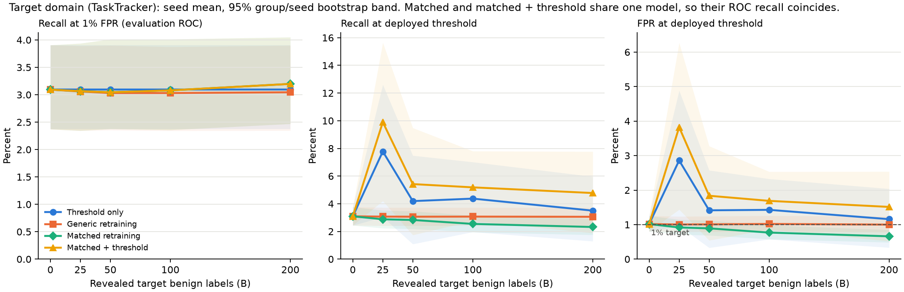
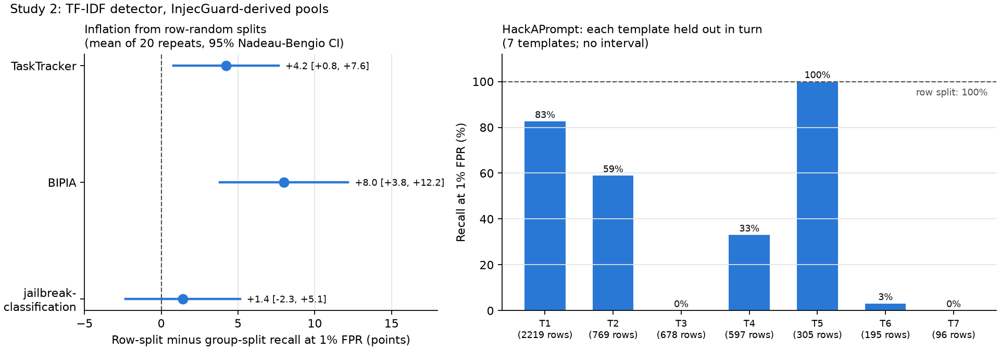

# Template Concentration in Public Prompt-Injection Data: Consequences for Evaluation and for Benign-Label Adaptation

*Capstone report draft, 2026-09-24. Author: Danny G. Two preregistered studies, each run once under a hash lock. AI assistance: study code, analysis and drafting were produced with an AI coding assistant under the author's direction; see Section 9.*

## Abstract

Public prompt-injection datasets reuse attack templates heavily. We measure how much this matters, using the public InjecGuard training release, word-shingle grouping, and a word+character TF-IDF logistic-regression detector. All findings are for this single linear detector.

**Audit.** Attack data are far more template-concentrated than benign data. In the 76,735-row release, 5,000 HackAPrompt attacks form 6 lexical groups, while benign sources are close to one row per group.

**Study 2: row splits versus template splits.** Over 20 repeated 70/30 splits, row-random splitting gave higher recall at 1% FPR than splitting by group:

- TaskTracker: +4.2 points (95% Nadeau–Bengio CI +0.8 to +7.6)
- BIPIA: +8.0 (+3.8 to +12.2)
- jailbreak-classification: +1.4 (−2.3 to +5.1; no inflation detected)

Holding out each HackAPrompt template in turn gave recalls from 0% to 100% (median 33%), against 100% under row splits. Example-level variance of attack recall was understated by a factor of 1.5 to 2.3. The design effects imply intervals about 1.2 to 1.5 times too narrow. A post-hoc check found a defect in our group splitter that invalidates the HackAPrompt interval and confounds the pooled primary estimate, so those numbers are not interpreted.

**Study 1: benign-label adaptation.** With 200 labeled benign documents from a new domain, retraining on them did not improve target recall at 1% FPR over threshold adjustment (+0.10 points, 97.5% CI −0.18 to +0.49) or over generic retraining (+0.15, −0.16 to +0.47). The source detector barely separated document-embedded injections from clean documents (AUROC 0.648), and benign labels carry no information about attacks.

**Scope.** Labels are upstream, with no human agreement study. Detector classes other than TF-IDF are untested. The within-dataset framing overlaps published dataset-level work, and its novelty is unverified.

## 1. Introduction

Prompt-injection detectors are text classifiers placed in front of LLM applications to flag inputs that try to override the application's instructions. They are trained and evaluated on public corpora assembled from games (HackAPrompt), jailbreak collections, synthetic insertions into documents (TaskTracker, BIPIA) and benign instruction data.

Two practical questions motivated this work.

1. **Evaluation.** When a corpus contains many near-copies of a few attack templates, a random row split puts copies of the same template on both sides. How much does that change the measured recall, and how much does it narrow the confidence intervals people report?
2. **Adaptation.** A team moving a detector to a new setting can usually afford a small number of benign examples from that setting. Is it better to spend them on the decision threshold or on retraining?

Contributions, each scoped to the data and detector used:

- A reproducible grouping and audit of the InjecGuard release. It quantifies template concentration on the attack side (Section 3).
- A preregistered comparison of row and group splits (Study 2). It shows recall inflation on two indirect-injection sources, wide per-template variation on HackAPrompt, and design effects above 1 (Section 5).
- A preregistered equal-budget comparison of three ways to spend benign labels (Study 1). It found a null result, and the cause is a recall floor (Section 4).
- Two practical notes on thresholds: a 1% threshold cannot be set reliably from fewer than about 100 benign labels, and labels reused for fitting and thresholding raise false alarms (Section 4.3).

## 2. Related work

*When Benchmarks Lie* (arXiv 2602.14161) evaluates activation-probe classifiers on 18 datasets and reports that same-source splits overstate performance compared with leave-one-dataset-out evaluation. PIDS-Bench (arXiv 2609.15017) assigns paraphrases and obfuscated descendants of a seed to the same partition, and reports seed means with example-level bootstrap intervals. Our Study 2 is closest to these: it examines the within-dataset, template-level case and its effect on interval width. We read the full text of neither the first paper nor PIDS-Bench's statistical sections, because both were inaccessible from our environment. The comparison relies on search-engine extracts and is **UNVERIFIED** (docs/LEAKAGE_NOVELTY.md).

Domain adaptation for injection detection is studied by CAPTURE, WAInjectBench (Appendix B), PromptShield (data composition) and EvoShield (online test-time adaptation). PIDS-Bench states that distribution-matched augmentation was untested in its experiments. InjecGuard/PIGuard introduces NotInject and discusses over-defense. *Defenses Against Prompt Attacks Learn Surface Heuristics* documents shortcut learning. We do not claim global novelty for either study (docs/RELATED_WORK.md).

## 3. Data, grouping and audit

**Source.** The InjecGuard GitHub release, revision `cb1531f`. Its training file has 76,735 rows from 22 source strings. Its evaluation files cover WildGuard, BIPIA and NotInject; PINT is private. For modeling we admit only 13 components whose own card or repository declares a license, for research use. No raw text is redistributed (docs/COMPONENT_PROVENANCE_AUDIT.md).

**Grouping.** Text is normalized with NFKC, casefolding and whitespace collapse. Two texts are linked if the word 5-gram shingles they share cover at least half of the smaller text's shingles (with at least 3 shared). Groups are transitive components. This links near-duplicates, clean and poisoned copies of the same document, and templates reused inside longer texts. It is lexical: paraphrased templates can escape it, and short formulaic prompts can be over-grouped.

**Audit** (docs/BENCHMARK_AUDIT.md; exhaustive counts, not estimates):

| Source, class | Rows | Groups | Largest group share |
| --- | ---: | ---: | ---: |
| HackAPrompt, attack | 5,000 | 6 | 56.9% |
| BIPIA, attack | 558 | 186 | 30.5% |
| Question Set, attack | 1,643 | 553 | 30.4% |
| TaskTracker, attack | 3,316 | 893 | 1.4% |
| chatbot_instruction_prompts, benign | 16,000 | 15,497 | 0.4% |
| TaskTracker, benign | 11,386 | 7,557 | 0.3% |

The training file is effectively disjoint from the public evaluation files: at most 1 of 1,435 evaluation items is contained in a training row. The 144-item validation set used for checkpoint selection consists of exact evaluation items (for example, 16 of each 113-item NotInject subset). InjecGuard's paper states that validation samples were drawn from these datasets. We report this as a disclosed selection effect and do not infer misconduct.

**Study pools.** After admission, deduplication (1,952 exact duplicates and 5 label conflicts removed) and removal of 66 evaluation-domain rows that shared a group with source data, 61,819 rows remain.

## 4. Study 1: spending a small benign-label budget

**Design** (docs/PREREGISTRATION.md, locked at commit `0f120e6` before scoring).

- **Domains.** Source S is direct prompts: instruction and chat data plus HackAPrompt and jailbreak-classification. Target T is TaskTracker, with instructions inserted into Wikipedia-style paragraphs. The untouched domain U is BIPIA, NotInject and WildGuard benign prompts.
- **Partitions.** Whole groups are assigned. T-eval has 10,139 benign and 2,877 injected rows in 7,432 groups. A separate bank of 1,000 benign T rows supplies adaptation labels.
- **Arms at B = 25/50/100/200 revealed benign target labels.**

| Arm | Model | Deployed threshold (1% FPR) from |
| --- | --- | --- |
| Frozen (= all arms at B = 0) | source | 10,031 source benign rows |
| Threshold only | source | the B revealed target rows |
| Generic retraining | refit with B extra source benign rows | source benign rows |
| Matched retraining | refit with the B target rows | source benign rows |
| Matched + threshold (secondary) | matched model | the same B target rows |

- **Seeds.** Seeds 17, 29, 42, 71 and 101 vary which bank rows are revealed; evaluation rows are fixed. Seeds are therefore not additional test data.
- **Confirmatory endpoint.** T-eval recall at the empirical 1% FPR point at B = 200, with two contrasts and Bonferroni-adjusted 97.5% intervals from a 10,000-replicate bootstrap that jointly resamples evaluation groups and seeds.

### 4.1 Confirmatory results

| Contrast (B = 200) | Estimate (points) | 97.5% CI | Per seed (17/29/42/71/101) |
| --- | ---: | --- | --- |
| Matched − threshold-only | +0.10 | [−0.18, +0.49] | +0.14 / +0.14 / +0.10 / +0.14 / +0.00 |
| Matched − generic | +0.15 | [−0.16, +0.47] | +0.07 / +0.24 / +0.28 / +0.10 / +0.07 |

Neither contrast met the superiority rule. Both intervals exclude the preregistered 2-point practical margin. The conclusion is limited to this detector and domain pair.

### 4.2 Why nothing moved

On T-eval, the frozen model's recall at 1% FPR was 3.1% [2.4, 3.9], and its FPR at the source-calibrated threshold was 1.0% [0.8, 1.3]. The source threshold therefore already met the false-alarm target on the new domain; the deficit was in detection. A post-hoc, exploratory AUROC on the locked scores was 0.648 [0.635, 0.661] on T, against 0.951 [0.943, 0.998] on source test data. Benign-only labels can move the benign side of the decision but provide no attack signal. The prespecified ×20 weighting sensitivity arm raised recall at 1% FPR to 4.3% [3.2, 5.8], the only visible ranking change.

### 4.3 Threshold notes

With B < 100 benign labels, the rule "at most 1% of revealed benign rows flagged" sets the threshold just above their maximum score. Its expected FPR is 1/(B+1), which is 3.8% at B = 25. Observed target FPR for threshold-only was 2.9% [1.0, 4.9] at B = 25 and 1.2% [0.3, 2.0] at B = 200. Setting the threshold from the same rows used for retraining (matched + threshold) produced higher FPR than threshold-only at every budget, for example 1.5% [0.5, 2.5] against 1.2% [0.3, 2.0] at B = 200. Those rows had already been fitted.

### 4.4 Other domains

Retraining with source-calibrated thresholds left BIPIA and NotInject false-alarm rates essentially unchanged. The frozen detector flagged 26.7% [24.0, 29.5] of WildGuard's benign but safety-sensitive prompts. This indicates that harmful *topics* are confused with injection, and no arm addressed it.

## 5. Study 2: row-random versus template-group splits

**Design** (docs/PREREGISTRATION_LEAKAGE.md, locked, run once with owner approval).

- **Pool.** All 61,819 rows, with 20 repeats of 70/30 splits (split seeds 31000–31019).
- **Splits.** Row split: random rows, stratified by label. Group split: whole groups.
- **Detector and metric.** The same TF-IDF detector is fit on the train side and scored once. The metric is recall at the evaluation-ROC point with FPR ≤ 1% over all benign test rows.
- **Inference.** Inflation is the mean of (row − group) over repeats, with Nadeau–Bengio corrected intervals, because repeats overlap. The design effect is the cluster (ratio-estimator) variance of recall divided by its binomial variance.
- **Amendment 1.** The first run crashed while writing output; no results were produced. The fix serialized undefined values as null.

### 5.1 Results

| Recall at 1% FPR (%) | Row split | Group split | Inflation (points) [95% CI] | Design effect, median [range] |
| --- | ---: | ---: | --- | --- |
| TaskTracker | 84.5 | 80.3 | +4.2 [+0.8, +7.6] | 1.5 [1.4, 1.6] |
| BIPIA | 91.2 | 83.2 | +8.0 [+3.8, +12.2] | 2.3 [1.6, 2.5] |
| jailbreak-classification | 88.4 | 87.0 | +1.4 [−2.3, +5.1] | 1.5 [1.1, 1.7] |

Leave-one-template-out on HackAPrompt (7 groups; descriptive, no interval). The study pools contain 7 HackAPrompt groups and the full release 6, because grouping is computed over different row sets.

| Held-out template (rows) | 2,219 | 769 | 678 | 597 | 305 | 195 | 96 |
| --- | ---: | ---: | ---: | ---: | ---: | ---: | ---: |
| Recall at 1% FPR (%) | 82.6 | 58.9 | 0.0 | 33.0 | 100.0 | 3.1 | 0.0 |

Under row splits, HackAPrompt recall was 100% in every repeat. The 678-row template that scored 0% is written in Unicode mathematical letters separated by slashes.

### 5.2 A defect in our design, and what it invalidates

The preregistered group splitter placed the largest groups first. As a result, the same 195-row HackAPrompt template was in the test side of all 20 group splits (verified post hoc). Two consequences follow:

1. **The HackAPrompt inflation interval is invalid.** The reported interval, +94.8 [+92.9, +96.7], describes training variation around one template.
2. **The preregistered pooled primary estimate is confounded.** Row-split tests contain about 1,450 easy HackAPrompt positives, and group-split tests contain 195 hard ones. The pooled estimate is +18.8 [+17.0, +20.7]; it formally meets the preregistered rule, but we do not interpret its size.

The per-source rows above for TaskTracker, BIPIA and jailbreak-classification are unaffected: their test groups varied across repeats, with a mean pairwise Jaccard of 0.34 for BIPIA. Amendment 2 (written after these results) specifies a randomized splitter and per-source endpoints for any further run.

## 6. Discussion

**Evaluation.** For this detector, splitting rows at random rather than by group raised recall at 1% FPR by a few points on two indirect-injection sources. It raised recall far more on a template-dominated attack source, where per-template recall ranged from 0% to 100%. With 6–7 independent templates, the HackAPrompt data cannot support a narrow recall estimate at all. Row counts in the thousands suggest otherwise. Example-level intervals for attack recall were too narrow on every source where a design effect could be estimated. For benchmark authors, the actionable points are:

- report the number of independent groups alongside row counts;
- split by group or template;
- compute intervals at the group level.

These points extend, rather than replace, the dataset-level evidence in prior work.

**Adaptation.** Study 1's null result follows from the recall floor. A detector with an AUROC of 0.65 on the target cannot be fixed by labels that describe only the benign class. The study does not show that matched adaptation is ineffective in general, and it does not test attack-labeled or transformer-based adaptation.

## 7. Limitations

- **One detector class.** Every model result is for TF-IDF logistic regression with fixed, untuned hyperparameters. Transformer detectors may behave differently. Study 2 Part B, which covers DeBERTa and released detectors, is specified but not run; it needs a GPU and Hugging Face access.
- **Labels.** Labels are upstream, with no human annotation or inter-annotator agreement. TaskTracker and BIPIA labels come from how the data were constructed.
- **Single release.** One merged data release, with domains defined by source string. Nested component licenses remain partly UNVERIFIED.
- **Lexical grouping.** Groups approximate templates.
- **Study 2 design defect.** It is described in Section 5.2. The pooled primary result is not interpretable.
- **Exploratory analyses.** Some analyses are post hoc and labeled so: Study 1's AUROC and per-template observations, and the Study 2 splitter check.
- **Novelty unverified.** Novelty relative to *When Benchmarks Lie* and PIDS-Bench has not been confirmed against their full texts.
- **Construct.** Recall here is text-classification recall, not agent attack success.

## 8. Reproducibility

From a clone of the InjecGuard release at `cb1531f`, run these scripts:

1. `scripts/build_study_pools.py`
2. `scripts/run_adaptation_study.py`
3. `scripts/analyze_adaptation_study.py`
4. `scripts/exploratory_diagnostics.py`
5. `scripts/audit_benchmark_overlap.py`
6. `scripts/run_split_comparison.py`
7. `scripts/plot_adaptation_study.py` and `scripts/plot_study2.py`

Hashes and commits are recorded in `results/study/PREREG_LOCK.json`, `results/study/run_log.json` and `results/leakage/PREREG_LOCK.json`. The environment was Python 3.11.15 with scikit-learn 1.7.2, numpy 2.2.6 and scipy 1.15.3, on 4 CPU cores. Runtimes were 16.4 minutes for Study 1's fits and about 10 minutes for Study 2. The test suite has 41 tests. Scripts refuse to overwrite outputs.

## 9. Disclosures

The project owner authorized both studies as exceptions to a standing gate that requires human annotation and full licensing clearance first (AGENTS.md). Those gates remain unmet and are reported as limitations. An AI coding assistant wrote most of the code, analyses and text under the author's direction. The author is responsible for verifying and defending every design choice before submission.

## References

- Shire, Y. K.; Kim, S.-C. *PIDS-Bench: Evaluating Prompt-Injection Detectors Under Over-Defense, Obfuscation, and Distribution Shift.* arXiv:2609.15017, 2026.
- *When Benchmarks Lie: Evaluating Malicious Prompt Classifiers Under True Distribution Shift.* arXiv:2602.14161, 2026. Authors and venue UNVERIFIED.
- Li, H.; Liu, X. *InjecGuard: Benchmarking and Mitigating Over-defense in Prompt Injection Guardrail Models.* arXiv:2410.22770; published as PIGuard, ACL 2025.
- Jacob, D. et al. *PromptShield: Deployable Detection for Prompt Injection Attacks.* CODASPY 2025; arXiv:2501.15145.
- Kholkar, G.; Ahuja, R. *CAPTURE: Context-Aware Prompt Injection Testing and Robustness Enhancement.* LLMSEC Workshop, ACL 2025.
- Liu, Y. et al. *WAInjectBench: Benchmarking Prompt Injection Detections for Web Agents.* arXiv:2510.01354, 2025.
- Yi, J. et al. *Benchmarking and Defending Against Indirect Prompt Injection Attacks on Large Language Models* (BIPIA). KDD 2025; arXiv:2312.14197.
- Abdelnabi, S. et al. *Get my drift? Catching LLM Task Drift with Activation Deltas* (TaskTracker). SaTML 2025; arXiv:2406.00799.
- Li, S. et al. *Defenses Against Prompt Attacks Learn Surface Heuristics.* ACL 2026.
- Zheng, Z. et al. *EvoShield: Selective Test-Time Adaptation for Prompt Injection Detection via Active LLM Querying.* Mathematics 14(10):1719, 2026.
- Schulhoff, S. et al. *Ignore This Title and HackAPrompt.* EMNLP 2023; arXiv:2311.16119.
- Nadeau, C.; Bengio, Y. *Inference for the Generalization Error.* Machine Learning 52:239–281, 2003.
